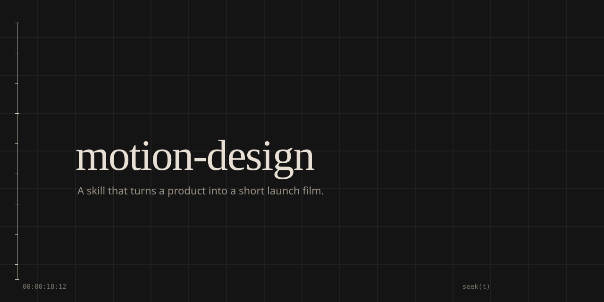

# motion-design

**A skill that turns a product into a short launch film.**

[](https://github.com/Detoy/motion-design)

Point an agent at a URL, a repo, a logo, or a screenshot. It inspects the source, writes a director brief, builds a deterministic `seek(t)` composition, looks at its own frames, and encodes a 15–25s reel with a poster and share copy.

The prompt is about 10% of the video. The rest is the harness.

```text
/motion-reel https://yourproduct.com --format vertical --tone polished
```

Works with Grok, Claude Code, Codex CLI, opencode, and anything else that loads [Agent Skills](https://agentskills.io).

---

## Install

```bash
npx skills add https://github.com/Detoy/motion-design --skill motion-design
```

Or copy the skill folder:

```bash
git clone --depth 1 https://github.com/Detoy/motion-design
cp -R motion-design/skills/motion-design ~/.agents/skills/motion-design
```

Discovery paths other agents already watch:

| Agent | Path |
|---|---|
| Claude Code | `~/.claude/skills/motion-design` |
| Codex / .agents | `~/.agents/skills/motion-design` |
| opencode | `.opencode/skills/motion-design` |
| Grok | `~/.grok/skills/motion-design` |

Same folder in every case. No extra config file.

## Use

From a product repo, or with a URL:

```text
let's /brag about this
make a 20s launch video for https://linear.app, vertical
/motion-reel --tone "fake Series A from 2016" --reference ./refs/frame.png
```

| Flag | Default | Notes |
|---|---|
| `--tone` | inferred | `default` `polished` `yc-parody` `chaotic` `deadpan` `cinematic` `app-store`, or a freeform line |
| `--format` | `landscape` | `landscape` 1920×1080 · `vertical` 1080×1920 · `square` 1080×1080 |
| `--duration` | ~20s | stay inside 15–25 |
| `--fps` | 30 | 60 only if the motion needs it |
| `--reference` | none | a frame, a film, or a named look |
| `--voice` | off | do not narrate on-screen type |
| `--no-music` / `--no-sfx` | on | |
| `--loop` | off | last frame equals first |

Output lands in `motion-output/`:

```text
motion-output/
  reel.mp4
  reel.jpg          poster, baked as frame 0
  share-copy.txt
  plan.md
  brief.md
  critique.md
  work/             composition, frames, stems
```

## How it works

1. **Inspect** the live site or the source. Steal real color, type, copy, and the product-in-use flow. Marketing pages are fallback, not the default subject.
2. **Plan** a hook-first storyboard. Readable type has a hold floor. Invented metrics are banned.
3. **Build** one HTML file that exposes `window.seek(t)` — a pure function of time. Motion uses closed-form springs, not CSS `ease-in-out`.
4. **Score** the picture. User track if you have one; otherwise `scripts/synth-bed.py` writes an original bed.
5. **Critique.** Still every scene midpoint and every mid-transition. Score hook, product-truth, type, contrast, layout. Fix anything under 8. Then encode.
6. **Deliver** `reel.mp4`, a settled poster, and copy you can paste.

Route A on purpose: HTML + system Chrome via CDP + ffmpeg. No Remotion account, no Hyperframes key. Name those stacks only if you want them.

## What it refuses to ship

- Centered sentence on a gradient, fading in
- Generic SaaS copy
- A logo slam as the only ending
- Ken Burns across a flat landing-page JPEG
- A crossfade between two busy layouts
- A “final” encode nobody looked at

Without a reference, models collapse to that default. Name a look or attach a frame.

## Requirements

- An agent that can read files, run a shell, and see images
- [Node.js](https://nodejs.org/) 20+
- [FFmpeg](https://ffmpeg.org/)
- Google Chrome or Chromium (`CHROME_BIN` if it is not on `PATH`)
- Python 3 + numpy only if you want the bundled synth bed

The renderer talks to Chrome over CDP. No `npm install`.

```bash
node skills/motion-design/scripts/render-frames.mjs \
  --html ./work/composition/index.html \
  --out ./work/stills \
  --times 0.2,3,8,14
```

## Repo layout

```text
skills/motion-design/
  SKILL.md              agent instructions
  references/           inspect, plan, engine, motion, sound, critique, tones
  scripts/              render-frames.mjs, bake-poster.sh, synth-bed.py
  assets/               motion.js, composition template, scrubber
```

`SKILL.md` is written for the model. This README is written for you. `AGENTS.md` and `llms.txt` are the short maps if an agent lands on the repo root.

## Credits

Creative laws lean on [latent-spaces/brag](https://github.com/latent-spaces/brag) — inspect the product, show the thing, hold type long enough to read it, every frozen frame should be postable.

The studio harness — `seek(t)`, closed-form springs, director brief, critique loop — follows the 12-step pipeline in [Movez, 27 Sep 2026](https://x.com/0xMovez/status/2104216919033192746).

Neither project is affiliated. If you ship a reel with this skill, the film is yours.

## License

MIT. See [LICENSE](LICENSE).
